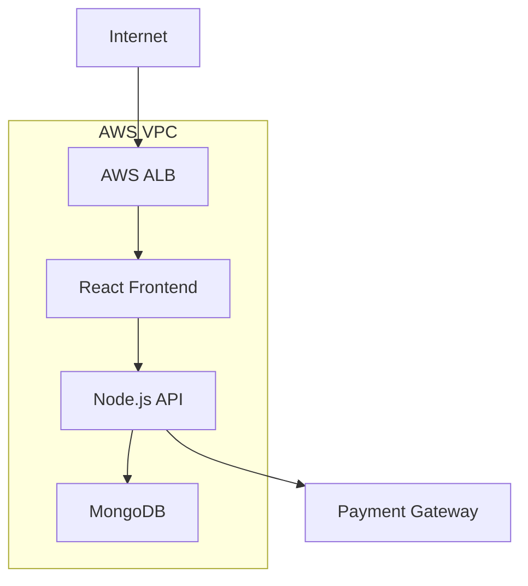

## Web Application Security Review Example

This example walks through a complete security review for a typical web application deployment.

### Project Context

The development team is deploying a new customer portal with the following characteristics:

- React frontend
- Node.js backend
- MongoDB database
- AWS cloud hosting
- Handles customer data
- Integrated with payment processing

### Step 1: Initial Request

The security review request was submitted with the following details:



### Step 2: Architecture Review

<!-- Using shortcode instead of direct image reference -->


#### Infrastructure Components

[Rest of the content remains the same...]