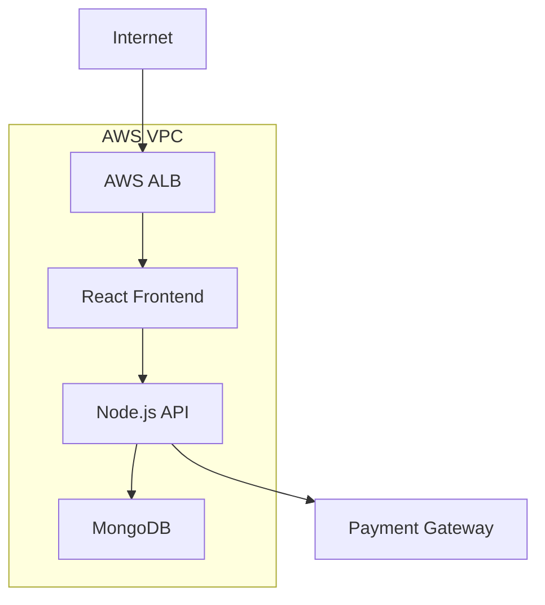

## Web Application Security Review Example

This example walks through a complete security review for a typical web application deployment.

### Project Context

The development team is deploying a new customer portal with the following characteristics:

- React frontend
- Node.js backend
- MongoDB database
- AWS cloud hosting
- Handles customer data
- Integrated with payment processing

### Step 1: Initial Request

The security review request was submitted with the following details:



### Step 2: Architecture Review

<!-- Using shortcode instead of direct image reference -->


#### Infrastructure Components



[Rest of the content remains the same...]

## Web Application Security Review Example

This example walks through a complete security review for a typical web application deployment.

### Project Context

The development team is deploying a new customer portal with the following characteristics:

- React frontend
- Node.js backend
- MongoDB database
- AWS cloud hosting
- Handles customer data
- Integrated with payment processing


### Step 3: Security Controls Assessment

#### Authentication Review


#### Data Protection Review


### Step 4: Finding Examples

#### Critical Findings

```yaml
finding:
  id: CRIT-001
  title: Unencrypted Data Storage
  severity: Critical
  description: Customer data stored in MongoDB without encryption
  impact: Potential exposure of sensitive customer information
  remediation: Implement encryption at rest using MongoDB native encryption
```

#### High Findings

```yaml
finding:
  id: HIGH-001
  title: Missing MFA
  severity: High
  description: Administrative access possible without MFA
  impact: Increased risk of unauthorized admin access
  remediation: Implement mandatory MFA for all admin accounts
```

### Step 5: Remediation Tracking

| Finding ID | Status | Days Open | Owner | Notes |
|------------|--------|-----------|--------|-------|
| CRIT-001 | In Progress | 3 | Database Team | Encryption being implemented |
| HIGH-001 | Planned | 2 | Security Team | MFA solution selected |

### Step 6: Final Approval

#### Approval Checklist

- [x] All critical findings addressed
- [x] High findings have remediation plan
- [x] Security controls documented
- [x] Compliance requirements met
- [x] Final testing completed

### Lessons Learned

1. **What Worked Well**
   - Early security team involvement
   - Clear communication channels
   - Automated testing integration

2. **Areas for Improvement**
   - Earlier infrastructure review
   - Better documentation access
   - More detailed initial requirements

### Supporting Materials

- [Complete Security Control Checklist](/templates/checklist/)
- [Detailed Findings Report Template](/templates/findings/)
- [Remediation Plan Template](/templates/remediation/)