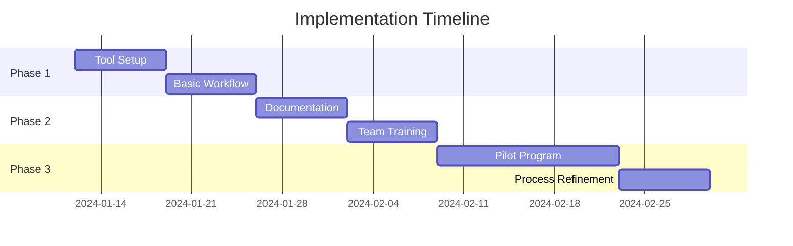

# GA Power and Electric Security Review Process
> A streamlined, cost-effective approach to security reviews

## 📋 Table of Contents
- [Quick Start](#quick-start)
- [Overview](#overview)
- [Tool Selection](#tool-selection)
- [Process Implementation](#process-implementation)
- [Templates](#templates)
- [Metrics & Reporting](#metrics--reporting)
- [Continuous Improvement](#continuous-improvement)

## 🚀 Quick Start

### Prerequisites
- Jira or similar project management tool
- GitHub/GitLab access
- SharePoint or similar document management system

### First Steps
1. Clone this repository
2. Run the setup script: `./scripts/setup.sh`
3. Configure your tools using the guides in `/docs/tooling-setup.md`
4. Start with a pilot project using templates in `/templates`

## 📖 Overview

### Goals
- Implement efficient security review process
- Minimize tool costs by leveraging existing systems
- Create clear, repeatable workflows
- Enable team collaboration and knowledge sharing

### Key Benefits
- Standardized review process
- Clear tracking and metrics
- Efficient resource utilization
- Improved security posture

## 🛠 Tool Selection

### Primary Stack
| Tool | Purpose | Cost Consideration |
|------|----------|-------------------|
| Jira | Tracking & Workflow | Use existing license |
| GitHub | Documentation & Code Review | Free tier available |
| SharePoint | Document Management | Existing O365 license |

### Alternative Options
| Alternative | Best For | Cost |
|------------|----------|------|
| MS Planner | Simple tracking | Free with O365 |
| Trello | Basic workflows | Free tier available |
| Google Workspace | Document collaboration | Existing license |

## 📝 Process Implementation

### Phase 1: Setup (Weeks 1-2)

### Implementation Checklist
- [ ] Configure Jira project
- [ ] Set up document repository
- [ ] Create basic templates
- [ ] Define team roles
- [ ] Train core team
- [ ] Run pilot project
- [ ] Gather feedback
- [ ] Refine process

## 📑 Templates

### Core Templates
All templates are available in the `/templates` directory:

\`\`\`
templates/
├── review-request.md
├── finding-report.md
├── remediation-plan.md
└── checklists/
    ├── architecture-review.md
    ├── security-controls.md
    └── compliance-check.md
\`\`\`

### Security Control Categories

| Category | Key Controls | Priority |
|----------|-------------|----------|
| Access Control | Authentication, Authorization | High |
| Data Protection | Encryption, Classification | High |
| Network Security | Segmentation, Firewalls | Medium |
| Application Security | Input Validation, Logging | Medium |

## 📊 Metrics & Reporting

### Key Performance Indicators (KPIs)
- Review completion rate
- Average time to completion
- Critical findings ratio
- Remediation success rate

### Automated Reports
Scripts in `/scripts/reporting/` generate:
- Weekly status updates
- Monthly metrics
- Quarterly trend analysis
- Annual reviews

## 🔄 Continuous Improvement

### Review Cycle
1. Collect metrics
2. Analyze performance
3. Gather feedback
4. Implement improvements
5. Document changes
6. Train team on updates

### Feedback Channels
- Monthly team retrospectives
- Anonymous suggestion form
- Client satisfaction surveys
- Peer review feedback

## 📚 Additional Resources

### Documentation
Full documentation is available in the `/docs` directory:
- Getting Started Guide
- Tool Configuration
- Process Workflows
- Best Practices

### Support
- Create issues in GitHub for process improvements
- Use Teams channel for daily communication
- Emergency escalation path in `/docs/support.md`

## 🤝 Contributing
We welcome contributions! Please see our [Contributing Guide](CONTRIBUTING.md) for details on:
- Code of Conduct
- Pull Request Process
- Development Guidelines
- Documentation Standards

## 📄 License
This project is licensed under the MIT License - see the [LICENSE](LICENSE) file for details.

---

*Last updated: January 12, 2025*